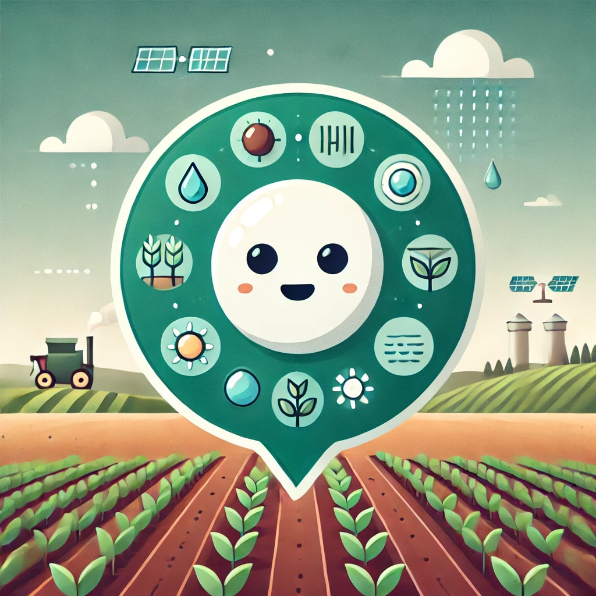
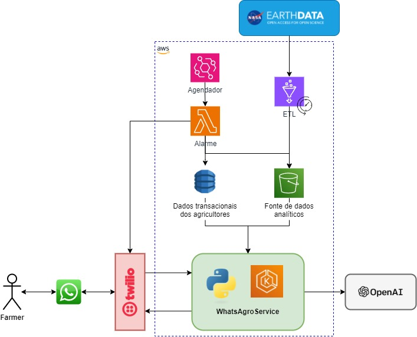

# **WhatsAgro - Agricultural Decision Support System via WhatsApp**

## **Table of Contents**

1. [Overview](#overview)
2. [Key Features](#key-features)
3. [Architecture](#architecture)
4. [Primary Data Source](#primary-data-source)

## **Overview**

**WhatsAgro** is an intelligent solution that leverages WhatsApp as a communication channel to provide farmers with insights based on climate, soil, and crop data. The platform integrates with NASA data APIs and Machine Learning technologies to analyze agricultural conditions and deliver real-time recommendations, enabling more informed and sustainable decisions regarding planting and irrigation.

### **Motivation**

Farmers face numerous challenges due to climate variability and inadequate water resource management. The idea behind **WhatsAgro** is to provide an easy-to-use solution that allows farmers to access relevant information on weather, soil moisture, and forecasts through WhatsApp, without the need for advanced technical skills.

---

## **Key Features**

- 🌦️ **Weather Forecasts**: Receive detailed weather forecasts based on farm location.
- 💧 **Soil Moisture Monitoring**: Obtain data on soil moisture levels to adjust irrigation.
- 🌱 **Planting Recommendations**: Suggestions for suitable crops based on weather and soil conditions.
- 📊 **Charts**: Comparison of precipitation, temperatures, and other conditions over time, delivered via WhatsApp.
- 🔔 **Automated Alerts**: Notifications about weather changes or critical soil conditions.
- 📍 **Geospatial Analysis**: Calculation of proximity to relevant climate data based on farm location.
- 🌍 **NASA Data APIs**: Integration with APIs providing updated soil, evapotranspiration, moisture, and forecast data.

---

## **Architecture**

The project uses a cloud-based microservice architecture, integrating multiple APIs and services, with communication and automation managed by cron jobs.

### **Main Components**:

1. **Microservice**: Python + FastAPI application that manages WhatsApp requests, processes data, and integrates with APIs.
2. **Twilio**: Integration with WhatsApp via Twilio to send and receive messages to/from farmers.
3. **S3 (AWS)**: Storage for updated CSV files with climate data.
4. **DynamoDB (AWS)**: Storage of farmer data, including location, query history, and recommendations.
5. **Glue (AWS)**: Data pipeline processing NetCDF4 data for advanced climate analysis.
6. **EventBridge**: Task scheduling for periodic alerts.
7. **NASA APIs**: Integration with satellite data (soil moisture, precipitation, etc.).
8. **OpenAI**: GPT-4 model integration to simplify communication with farmers and translate NASA data into actionable insights.
9. **WhatsApp**: The main channel to receive messages from farmers and send alerts.

### **Workflow**:

1. The farmer interacts via WhatsApp.
2. The system collects the location and queries relevant climate data.
3. Responses and recommendations are provided based on the analyzed data.
4. Charts and comparisons are sent as requested, or automatic alerts are triggered.

---

## **Primary Data Source**

- **NASA EARTHDATA**: A NASA platform that provides access to a vast collection of Earth observation data collected by NASA satellites, sensors, and research instruments, as well as from other space agencies. This data is used by scientists, researchers, policymakers, and developers to monitor and understand environmental, climatic, and natural resource changes.

---

# Links

- [Project Demo](https://www.youtube.com/shorts/Sib7wPyDzaM)
- [Pitch Deck](https://www.canva.com/design/DAGS0U-tBjQ/lUXLbsBm-DImlKl-1ZsIJw/edit?utm_content=DAGS0U-tBjQ&utm_campaign=designshare&utm_medium=link2&utm_source=sharebutton)

# Team WhatsAgro 🌾🚜

- [Leonardo Ishii](https://www.linkedin.com/in/leonardoishii)
- [Lucas Paiva](https://www.linkedin.com/in/lucashenri)
- [Lucas Lima](https://www.linkedin.com/in/lucas-lds)
- [Marcio Jacob](https://www.linkedin.com/in/marcio-jacob)
- [Matheus Macedo](https://www.linkedin.com/in/matheuscont)
- [Matheus Poterucha](https://www.linkedin.com/in/matheuspoterucha)
